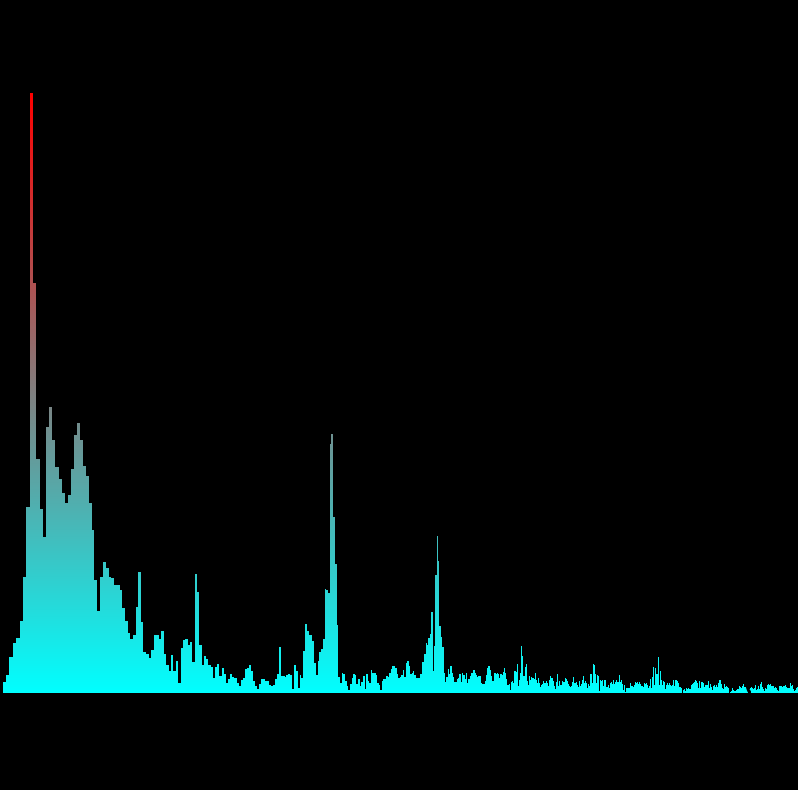

# Audio Spectrum Analyzer

Coded in C++ with OpenGL (graphics) and SFML (audio).

Release build found here:

Dropbox https://www.dropbox.com/s/m7ylbb7p05z3ujm/Audio%20Spectrum.zip?dl=0

Google Drive https://drive.google.com/file/d/1MGmVodEdRH8441-N01GUeOk1WTAX_q2j/view?usp=sharing
